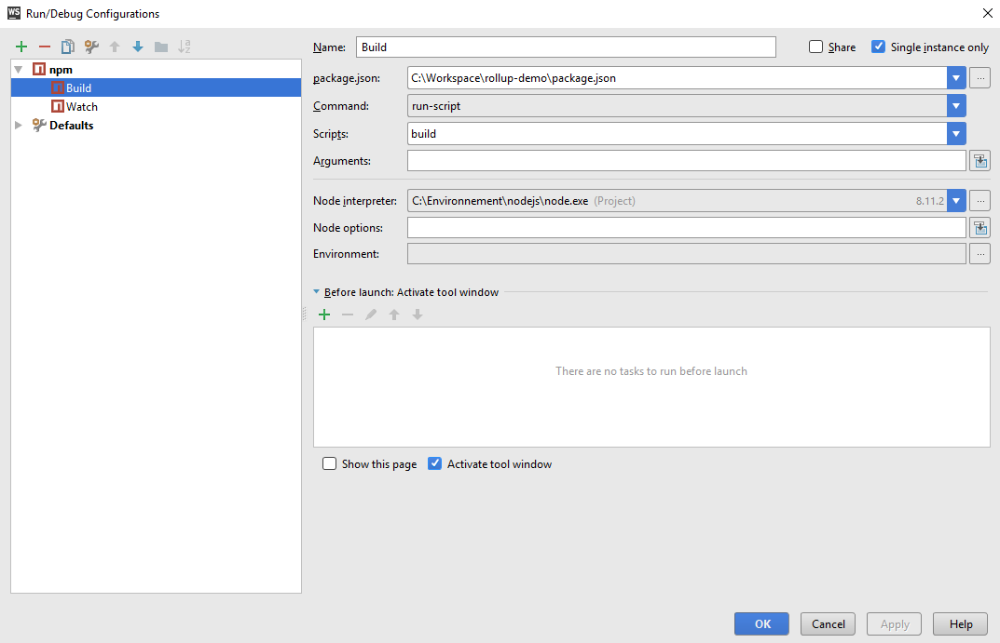
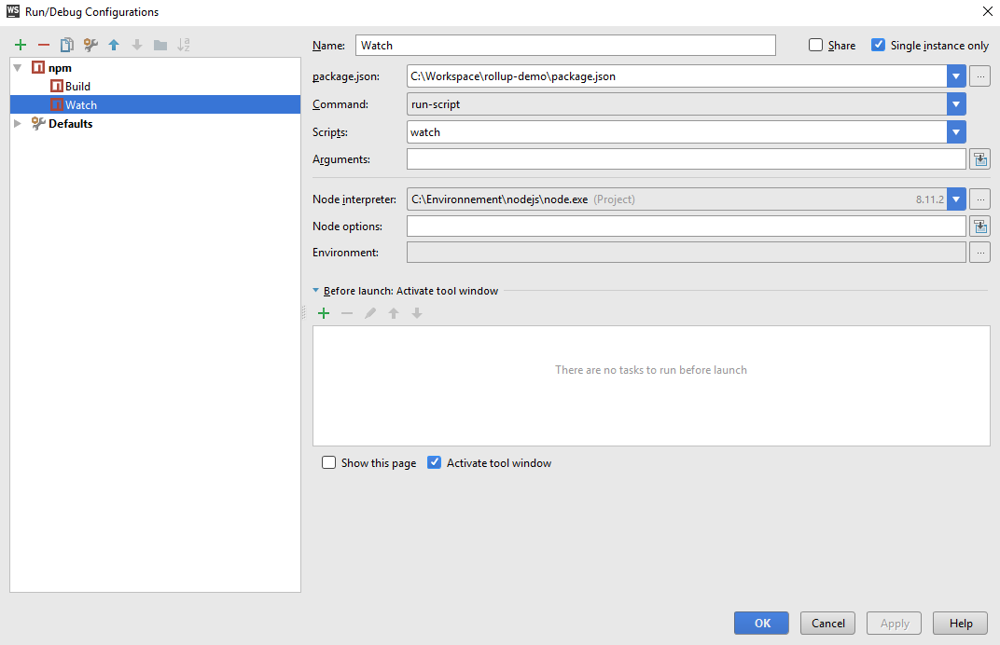

Demo Rollup
===========

This project contains a basic configuration to transpile an ecma6 code to ecma5. 
The ecma6 code is into the file 'src/index.js'. 
The ecma5 code is into the file 'dist/index.js'. 
A 'test' folder allow to run the transpiled code into an html file.

Plugins
-------

rollup-plugin-babel : transpiler ecma6 to ecma5 
rollup-plugin-clear : Delete the specified folder 
rollup-plugin-javascript-obfuscator : Obfuscate the code 
rollup-plugin-commonjs : Convert CommonJS modules to ES6, so they can be included in a Rollup bundle 
rollup-plugin-node-resolve : Locate modules using the Node resolution algorithm, for using third party modules in node_modules 

Configurations
--------------

Open 'Edit configurations' and create two 'npm' tasks named 'Build' and 'Watch'.  

### Build task #

This configuration runs the 'rollup.config.js' file.   

   

### Watch task #
 This configuration runs the 'rollup.config.js' file when you execute 'ctrl + s' into the 'src' and 'test' folders.   
